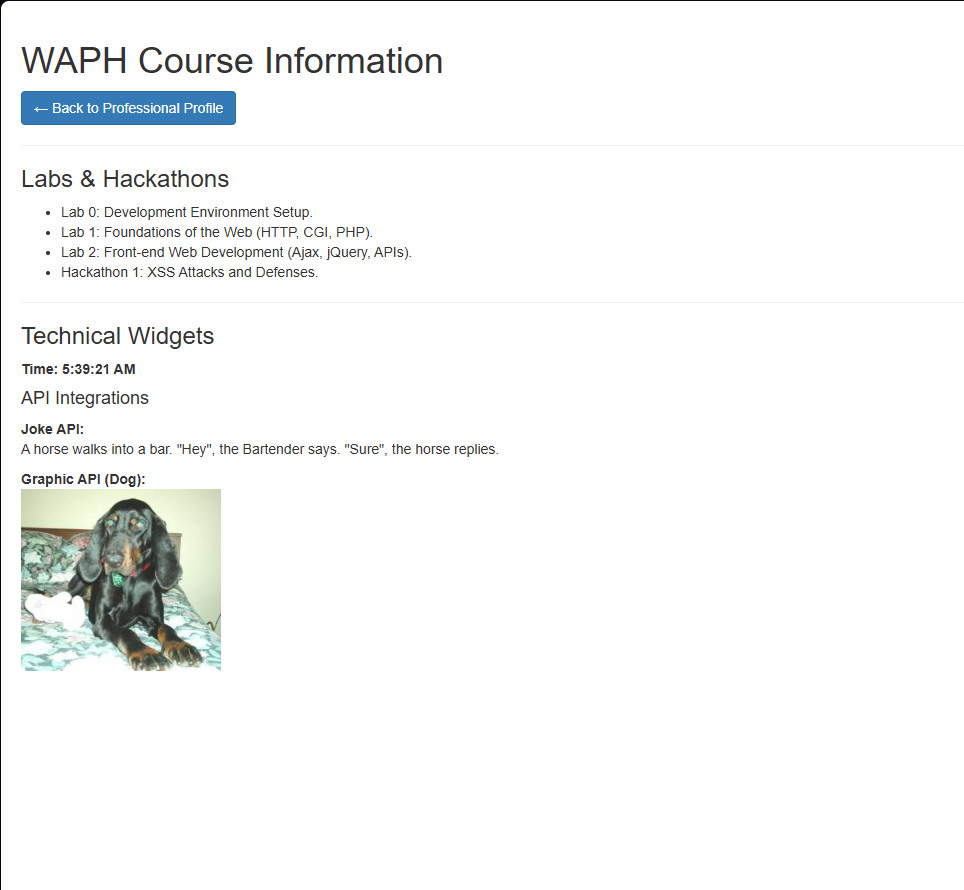

# Individual Project 1 Report
# WAPH-Web Application Programming and Hacking

## Instructor: Dr. Phu Phung

## Student

**Name**: Viplav Nagpal

**Email**: nagpalvv@mail.uc.edu

**Short-bio**: I am a Computer Science Junior at the University of Cincinnati with a strong foundation in AI/ML, data analytics, and edge computing. I specialize in building end-to-end projects.

# Individual Project 1 - Professional Profile Website

## Overview
The objective of this project was to develop and deploy a professional front-end profile website on the `github.io` cloud service. This assignment expanded my front-end development skills by requiring the use of CSS frameworks for a professional appearance, integration of public Web APIs to create dynamic content, and the implementation of JavaScript cookies to track user sessions. Through this project, I learned how to manage front-end dependencies, handle asynchronous API requests, and persist data in a client-side environment.

* **Live Website URL**: [https://nagpalvv.github.io/](https://nagpalvv.github.io/)
* **GitHub Repository**: [https://github.com/nagpalvv/waph-nagpalvv.github.io](https://github.com/nagpalvv/waph-nagpalvv.github.io)

---

## Tasks and Sub-tasks

### 1. Professional Profile and Deployment
* **Summary:** Created a responsive professional website using the "Start Bootstrap" resume theme. Included my background, education, and professional experience, as well as a linked `waph.html` course page.
* 

### 2. Technical Requirements: Clocks and Web API Integration
* **Summary:** Integrated a digital and analog clock for real-time display and configured two public Web APIs:
    * **JokeAPI:** Fetches and displays a new programming joke every 60 seconds.
    * **Dog API:** Dynamically fetches and displays a random dog graphic.
    * *Disclaimer:* Content generated by third-party APIs (JokeAPI/Dog.ceo). I am not responsible for the content.
* 

### 3. JavaScript Cookies
* **Summary:** Implemented `document.cookie` logic to detect first-time visitors and returning users, displaying a personalized "Welcome back!" message with the last recorded visit timestamp.

---

## Conclusion
This project successfully demonstrated the integration of dynamic server-side data into a static front-end framework. By utilizing jQuery and modern `fetch()` patterns, I improved my ability to manage asynchronous data streams while adhering to security best practices, such as sanitizing third-party content and managing client-side cookies.	